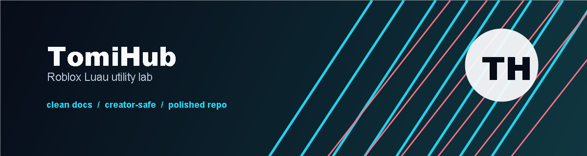

<p align="center">
  
</p>

# TomiHub

TomiHub is a small Luau utility-lab repository by **Tomi** for experimenting with Roblox client UI patterns, quick-access menus, and creator-side workflow ideas.

This repository is being cleaned up into a more professional public project: clearer documentation, safer project boundaries, and a presentation style that looks maintained instead of thrown together.

## Project Status

| Area | Status |
| --- | --- |
| Public repository presentation | Polished |
| Documentation | Active |
| Script cleanup | Planned |
| Roblox Studio package structure | Planned |
| Release workflow | Planned |

## What This Repo Is For

- Building and documenting Roblox Luau UI experiments.
- Practicing cleaner script organization and naming.
- Turning rough ideas into maintainable creator tools.
- Keeping project rules clear for collaborators and future users.

## Responsible Use

Use this repository only in Roblox experiences you own, manage, or have explicit permission to test. TomiHub is not maintained as a tool for disrupting other creators' games, bypassing platform protections, or violating Roblox rules.

## Repository Map

```text
.
├── LOADSTRING              Legacy loader kept for compatibility
├── secrethulaan mo         Legacy Luau script, unchanged in this polish pass
├── assets/                 README and brand visuals
├── docs/                   GitHub Pages landing page
├── CONTRIBUTING.md         Contribution rules and project standards
├── SECURITY.md             Responsible disclosure and safety policy
└── CHANGELOG.md            Project history
```

## Roadmap

- Rename legacy files into a cleaner `src/` structure.
- Split UI creation, game-specific logic, and configuration into modules.
- Add a Roblox Studio test place or example experience.
- Add screenshots and release notes for stable versions.
- Replace rough internal naming with creator-friendly language.

## Links

- Repository: <https://github.com/warpusTOM/TomiHub>
- Project page: <https://warpustom.github.io/TomiHub/>

## Credits

Created by **Tomi**.
